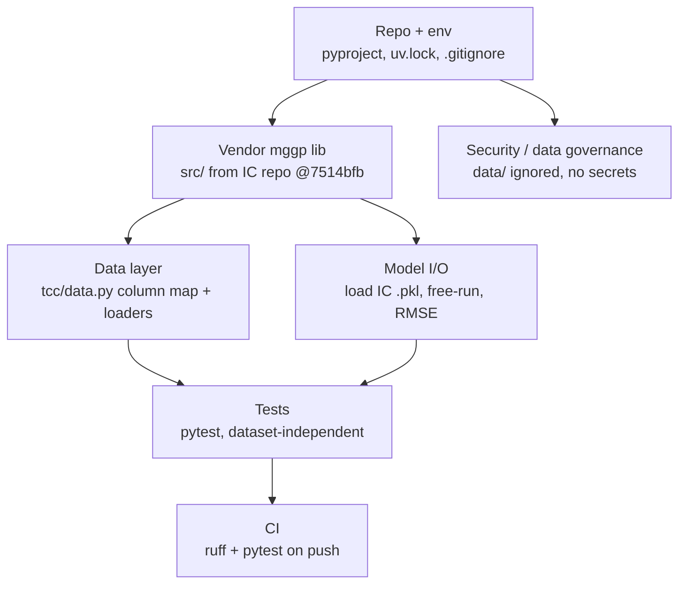
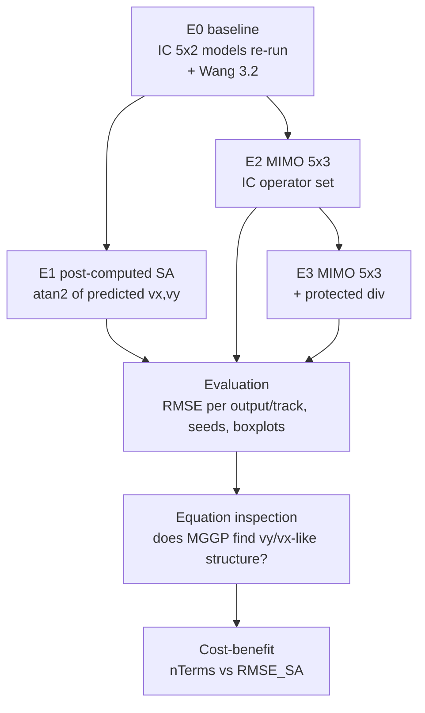
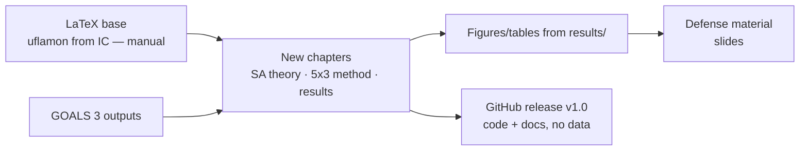

# GOALS.md — TCC: Slip-angle estimation as a third MIMO output of the IC's MGGP virtual sensor

> **Status: GOALS 1 done (2026-09-21).** The Wang/Jilin database is now in **`Database/`** (gitignored; the folder
> name follows the IC repo, not the `data/` this plan originally said — read `data/` as `Database/` below). The IC
> repo @ `7514bfb` and the T19/T48 `.pkl` models are also local at `D:\ProjetosPessoais\IC\TreinamentoMGGP_2_0\`.
> Nothing is blocked on the dataset any more.
>
> Context: [`CONTEXTO_IC.md`](CONTEXTO_IC.md) (Portuguese summary of the IC this TCC extends).
> Repo: https://github.com/alexmiguel011014-stack/tcc.git · Stack decided by the user: **Python + original `mggp` lib** (DEAP + NumPy).

## Fixed facts `/execgoals` must not re-derive

| Fact | Value | Source |
|---|---|---|
| IC repo (lib + trained models) | https://github.com/alexmiguel011014-stack/TreinamentoMGGP_2_0.git @ `7514bfb` | verified 2026-09-20 |
| Lib location inside IC repo | `src/{base.py, mggp.py, predictors.py, crossings.py, mutations.py}`; imports are absolute `from src.…` | read |
| Lib supports N outputs | `nOutputs = outputs.shape[1]`; MIMO mode auto-selected when `nInputs>1 and nOutputs>1`; `main.py` history shows a 2×3 F16 run | `src/mggp.py:90-104` |
| Operators available in lib | `mul`, `sign`, `subtraction`, `add` — **no division** | `src/base.py:73-78` |
| FROE pruning | `_froe_pruning_mimo` exists in current `src/mggp.py:843`; IC report says it was not usable in MIMO — treat as unverified | read |
| Excel layout | `pd.read_excel(path, header=None)`, 24 float columns, no header; **u = cols [14, 2, 22, 23, 11]** (ax_nobias, acc_y raw, wheel front, wheel rear, YawRate raw); **vx = col 18 (vx_smooth), vy = col 17 (vy_smooth)**. Full legend in `docs/column_inventory.md`; slip angle: col 3 `Sideslip_angle` (deg, raw), col 19 `SA_smooth` (rad). Wheel speeds are rad/s (r_eff ≈ 0.30 m), not m/s. | MATLAB export legend + `TrainingMGGP_LOOP.ipynb` |
| Pre-processing in the final IC grid | none — raw values, no offset, no scaler (`return u, y_raw`) | `TrainingMGGP_LOOP.ipynb` |
| Runs per config in the IC | 10 independent evolutions per (nDelays, nTerms, maxH) → `modelo_rmse_1..10.pkl`; no fixed seeds | notebook + repo tree |
| IC fixed params | generations 300, populationSize 300, k 300, MShooting train / FreeRun test, mutationRate 0.3, crossoverRate 0.8, elitePercentage 10, operators `['add','subtraction','mul']`, froe_mode False | IC report Tab. 3.1 |
| IC anchor models | **T19** (RESULTADOS-2/Treinamento_19, `modelo_rmse_6.pkl`, nDelays [1,2,5,10], nTerms 3, maxH 5, RMSE 0.2239) · **T48** (RESULTADOS-3/Treinamento_48, nDelays [1,2,5,10,25,50], nTerms 7, maxH 6, RMSE 0.2121) | IC report |
| Tracks | Wang 2.1 train · 2.2 validation · 3.1 test A · 8.1 test B · **3.2 unused in IC → available as test C** | IC report |
| Slip angle definition | β = atan2(v_y, v_x). **GOALS 1 verdict: computed** — col 3 = atan2(vy 10, vx 9) to 1e-16; col 19 = ~21-sample moving average of col 3; on wang31/81/32 `vy_smooth` carries a +0.30…+0.37 m/s constant offset that SA was never recomputed for. Third output for GOALS 3 := atan2(col 17, col 18), not col 19. | `docs/slip_angle_provenance.md` |
| Local toolchain | Python 3.12.10, `uv` installed, `gh` CLI authenticated, `pdftotext` available | checked |
| Dataset licensing | Jilin University partnership data — **never commit `Database/` to the public repo** (`.gitignore` in place) | user context |

---

## GOALS 1 — Research: is the slip angle in the Wang database measured or computed?

Suggested: sonnet · medium — small numeric script, but the answer decides the whole experiment design in GOALS 3.

- [x] Question (precise): "For each of the 5 Wang tracks, does any column equal `atan2(vy, vx)` (rad or deg, ±sign) to within floating-point/rounding tolerance? If yes → SA is *computed* from vx, vy and carries no independent information. If the closest column differs by more than sensor-noise level → SA is *measured* (GPS/INS) and is a legitimate independent third output." — done when: this sentence is the first line of `docs/slip_angle_provenance.md`.
- [x] `(manual)` Copy `wang21dv_bic_MGGP.xlsx`, `wang22dv_bic_MGGP.xlsx`, `wang31dv_bic_MGGP.xlsx`, `wang32dv_bic_MGGP.xlsx`, `wang81dv_bic_MGGP.xlsx` into `Database/` on the machine that will run this — done when: `python -c "import glob; print(sorted(glob.glob('Database/wang*.xlsx')))"` lists all five. *(done 2026-09-21)*
- [x] Column inventory: `scripts/inspect_columns.py` prints, per track, column index, dtype, min/max/mean/std, and the first 3 rows for **every** column (not only the 7 used by the IC) → `docs/column_inventory.md` — done when: the file exists for all 5 tracks and the 7 known columns match the values the IC used (vx in col 18 has magnitude ~m/s, yaw rate col 11 ~rad/s).
- [x] Provenance check: `scripts/check_slip_angle.py` computes `beta_rad = atan2(vy, vx)`, `beta_deg`, `vy/vx`, and `-beta_*`; for every column not in `{2, 11, 14, 17, 18, 22, 23}` reports RMSE, max|Δ|, Pearson r against each candidate; picks the best column; classifies **computed** if max|Δ| < 1e-3 rad (or < 0.06°) on all 5 tracks, else **measured/independent** — done when: the script exits 0, writes `docs/slip_angle_provenance.md` (table per track + verdict) and `docs/fig/slip_angle_overlay_<track>.png` (SA column vs atan2 over time + residual).
- [x] Edge cases recorded in the same doc: samples where |vx| < 0.5 m/s (atan2 ill-conditioned at standstill), how many, and how the SA column behaves there (NaN? zero? saturates?) — done when: the doc has a "low-speed behaviour" section with counts per track.
- [x] Decision written into GOALS 3 header (`Verdict: computed | measured`) and mirrored in the memory file `tcc-slip-angle-direction` — done when: both mention the verdict and the chosen SA column index.

---

## GOALS 2 — Build: reproducible project scaffold around the original `mggp` lib

Suggested: sonnet · medium — mostly mechanical, but vendoring the lib and reproducing IC numbers needs care.

### Repo & environment
- [ ] `git init` on `main`, remote `origin = https://github.com/alexmiguel011014-stack/tcc.git`, first commit contains `CONTEXTO_IC.md` + `GOALS.md` — done when: `git remote -v` shows origin and `git log` has the commit. *(done in this session — verify only)*
- [ ] `.gitignore`: `data/`, `results/`, `*.pkl`, `*.png` under `results/`, `.venv/`, `__pycache__/`, `.pytest_cache/`, `.ruff_cache/`, `graphify-out/`, `repomix-output.xml`, `.env` — done when: `git check-ignore data/wang21dv_bic_MGGP.xlsx results/x.pkl` prints both paths.
- [ ] `pyproject.toml` (project `tcc`, `requires-python = ">=3.12,<3.13"`) with runtime deps pinned to the IC's `requirements.txt` versions: `deap==1.4.3`, `numpy==2.2.6`, `pandas==2.3.3`, `scipy==1.15.3`, `scikit-learn==1.7.2`, `matplotlib==3.10.8`, `numba==0.64.0`, `tqdm==4.67.3`, `joblib==1.5.3`, plus `openpyxl` (required by `pd.read_excel`, missing from the IC list), `dill` (the IC serialised models with it); dev deps `pytest`, `ruff` — done when: `uv sync` completes and `uv run python -c "import deap, numpy, pandas, openpyxl, dill; print('ok')"` prints ok.
- [ ] `uv.lock` committed; `requirements.txt` exported via `uv export --no-dev > requirements.txt` for the lab PC without uv — done when: both files exist and `pip install -r requirements.txt` in a fresh venv succeeds (`(manual)` on the other PC).
- [ ] `README.md`: what the TCC is (1 paragraph), how to get the data (not included — where to ask), `uv sync`, how to run the SA check, how to run an experiment, how to run tests — done when: a reader can execute GOALS 1's script from the README alone.
- [ ] `CLAUDE.md` for this repo: column map, "never commit data/", the IC anchors (T19/T48), the operator-set caveat, and that `src/` is vendored (edit only via documented patches) — done when: the file exists and each fact above is in it.

### Vendor the `mggp` library
- [ ] Copy `src/` (5 files) from `TreinamentoMGGP_2_0` @ `7514bfb` into `src/` at this repo's root, keeping the `from src.…` absolute imports untouched — done when: `uv run python -c "from src.mggp import MGGP; print(MGGP)"` works from the repo root.
- [ ] `src/VENDORED.md`: source repo, commit hash, date, list of local patches (initially "none") — done when: the file exists; every later edit to `src/` adds a line here.
- [ ] Smoke test `tests/test_lib_smoke.py`: synthetic MIMO NARX system (2 inputs, 3 outputs, N=400, generated with a known polynomial + noise), `MGGP(..., generations=3, populationSize=20, nDelays=[1,2], nTerms=2, maxHeight=3, operators=['add','subtraction','mul'])`, `run()`, then `predict('FreeRun')` returns arrays of shape (N−lag, 3) — done when: `uv run pytest tests/test_lib_smoke.py` passes in < 60 s without any dataset (proves the 5×3 path works before real data exists).

### Data layer
- [ ] `tcc/data.py`: constants `INPUT_COLS = [14, 2, 22, 23, 11]`, `VX_COL = 18`, `VY_COL = 17`, `SA_COL = None` (set by GOALS 1), `TRACKS = {"wang21": "train", "wang22": "val", "wang31": "testA", "wang81": "testB", "wang32": "testC"}`; `load_track(name, outputs=("vx","vy")) -> (u, y, df)`; raises a clear `FileNotFoundError` naming `data/` when missing — done when: `tests/test_data.py` (using a 30-row synthetic `.xlsx` written into `tmp_path` with 24 columns) asserts shapes (N,5)/(N,2)/(N,3) and the column mapping.
- [ ] `tcc/metrics.py`: `rmse(y_true, y_pred)` per column, `slip_angle(vx, vy) -> atan2`, `sa_from_predictions(y_pred_2col)`; degrees helper — done when: unit tests with hand-computed values pass (e.g., `slip_angle(1, 1) == pi/4`).

### Model I/O (reproduce the IC before extending it)
- [ ] `tcc/models.py`: `load_ic_model(path)` (dill/pickle, same loader the IC notebooks used), `free_run(model, u, y, k=300) -> y_pred`, `describe(model) -> str` (genes + coefficients, GPTIPS-style like `VALIDACAO_FAST.ipynb`) — done when: `tests/test_models.py` round-trips a model produced by the smoke test.
- [ ] `(manual)` Fetch the two anchor models from the IC repo into `results/ic_anchors/`: `RESULTADOS-2/Treinamento_19/TRAINING/modelo_rmse_6.pkl` and the best of `RESULTADOS-3/Treinamento_48/TRAINING/modelo_rmse_*.pkl` (pick by `relatorio_validacao_rmse.csv`) — done when: both files exist locally (`gh api …/contents/<path>` or clone with `--filter=blob:none` + sparse checkout).
- [ ] `scripts/reproduce_ic.py`: free-run T19 and T48 on Wang 2.2 / 3.1 / 8.1 (+ 3.2 for the first time) and print RMSE vx/vy — done when: T19 reproduces 0.2239 ± 0.005 overall and T48 0.2121 ± 0.005 (tolerance for float/loader differences); any larger gap is investigated before GOALS 3 starts.

### Tests, lint, CI
- [ ] `ruff` configured in `pyproject.toml` (`line-length = 100`, `select = ["E","F","I","B"]`, `exclude = ["src"]` — the vendored lib is not reformatted) — done when: `uv run ruff check .` is clean.
- [ ] `uv run pytest` runs the dataset-independent suite (`test_lib_smoke`, `test_data`, `test_models`, `test_metrics`); dataset tests are marked `@pytest.mark.dataset` and auto-skip when `data/` is absent — done when: the full run passes on this machine (no data) with the dataset tests reported as skipped, not failed.
- [ ] `.github/workflows/ci.yml`: `uv sync`, `ruff check`, `pytest -m "not dataset"` on push/PR, Python 3.12, Ubuntu — done when: the first push after this item shows a green run in `gh run list`.

### Security / data governance
- [ ] `(manual)` Decide with the advisor whether the public repo may host derived artefacts (plots, CSV of predictions) from the Jilin data; default = **no raw data, aggregated results only** — done when: the decision is written in `README.md` ("Data" section) and `CLAUDE.md`.
- [ ] Pre-commit guard: `scripts/check_no_data.sh` (fails if any `data/*.xlsx` or `*.pkl` > 1 MB is staged) wired via `.git/hooks/pre-commit` (`(manual)` install step documented in README) — done when: staging a dummy `data/x.xlsx` is rejected.
- [ ] `uv run pip-audit` (or `uv tool run pip-audit`) shows no critical CVE in the pinned set; if `numpy 2.2.6`/`scikit-learn 1.7.2` are flagged, record the exception in `CLAUDE.md` (pinned for parity with the IC) — done when: the audit output is saved to `docs/audit.txt`.

---

## GOALS 3 — Experiments: 5 inputs × 3 outputs (v_x, v_y, β) vs. post-computed slip angle

`Verdict from GOALS 1: computed — SA column: 19 (SA_smooth, rad; raw = col 3, deg)`. β for training/evaluation := **atan2(col 17, col 18)**; see `docs/slip_angle_provenance.md` §Verdict for why col 19 is not used as-is, and §Part D for the a_x/a_y input-choice question to settle with the advisor before E2.

Suggested: opus · high — experimental design with a data-dependent fork, multi-hour training runs that cannot be cheaply retried, and results that need interpretation, not just numbers.

### Design (settle before any training)
- [ ] Design note `docs/experiment_design.md` covering: (i) the two arms **A = 5×2 + atan2(v̂y, v̂x)** and **B = 5×3 MIMO**, (ii) why B can only beat A if SA is *measured* or if the extra output regularises vx/vy jointly (state the hypothesis explicitly), (iii) SA units for training (rad — same scale issue as vy vs vx; document whether to train on deg to balance magnitudes and convert back), (iv) seeds: **5 independent runs per config** (IC used 10; halve to fit the deadline, `(manual)` confirm with advisor), (v) tracks: train Wang 2.1, validate 2.2, test 3.1, 8.1, **3.2** — done when: the note exists and the advisor has seen it `(manual)`.
- [ ] Config anchors: reuse **T19** and **T48** hyper-parameters exactly (same nDelays, nTerms, maxH, 300/300/k=300, rates) so any change is attributable to the third output — done when: `experiments/configs/{t19,t48}_5x3.json` exist and diff only in `outputs` vs the IC's `parametros_utilizados.csv`.
- [ ] Runtime budget: time one T19-config 5×3 run end-to-end and record it in the design note; if > 6 h, `(manual)` decide between fewer seeds, `generations=150`, or running on the lab PC — done when: the measured wall time is written down.

### Runs
- [ ] **E0** `scripts/run_e0_baseline.py`: free-run T19/T48 on all 4 held-out tracks, save `results/e0/predictions_<model>_<track>.csv` — done when: RMSE matches GOALS 2's reproduction item.
- [ ] **E1** `scripts/run_e1_postsa.py`: `β̂ = atan2(v̂y, v̂x)` from E0 predictions; RMSE_β (rad and deg) per track vs the SA column (or vs atan2 of measured vx, vy if SA is computed) — done when: `results/e1/rmse_sa.csv` exists with one row per (model, track).
- [ ] **E2** `scripts/run_e2_mimo3.py --config t19|t48 --seed N`: `MGGP(inputs=u, outputs=[vx, vy, β], operators=['add','subtraction','mul'], …)`, MShooting train on 2.1, FreeRun on 2.2/3.1/8.1/3.2; saves model `.pkl`, `params.json`, `rmse.csv`, per-track prediction CSVs under `results/e2/<config>/seed_<N>/` — done when: 5 seeds × 2 configs = 10 runs completed and every run has all files.
- [ ] Lib patch: add `"div": (protected_div, 2)` to `src/base.py::primitives_sets` (`protected_div(a, b) = a/b if |b| > 1e-6 else 1.0`, NumPy-vectorised), logged in `src/VENDORED.md` — done when: the smoke test with `operators=[...,'div']` passes and a unit test asserts `protected_div(1, 0) == 1.0`.
- [ ] **E3** same as E2 with `operators=['add','subtraction','mul','div']`, T19 config only, 5 seeds — done when: 5 runs completed under `results/e3/`.
- [ ] FROE check (from IC future work): one E2/T19 run with `froe_mode=True`; if it crashes in MIMO, capture the traceback in `docs/froe_mimo_status.md` and stop (not a TCC blocker); if it runs, compare term count and RMSE to the non-pruned twin — done when: the doc states one of the two outcomes.

### Evaluation
- [ ] `scripts/evaluate.py` → `results/summary.csv`: rows = (arm, config, seed, track), cols = RMSE_vx, RMSE_vy, RMSE_β_rad, RMSE_β_deg, nTerms_total, tree depth; plus `results/summary_agg.csv` (mean ± std over seeds) — done when: both CSVs exist and cover E0/E1/E2/E3.
- [ ] Figures (`docs/fig/`): boxplot RMSE_β per arm per track; boxplot RMSE_vx/vy showing whether adding β changed the vx/vy quality vs E0; time overlay of β measured vs A vs B on the worst-case track; cost-benefit RMSE_β vs nTerms — done when: the four PNGs exist and are referenced from `docs/results.md`.
- [ ] Equation inspection `scripts/inspect_equations.py`: for the best E2/E3 models print the β-output genes; classify whether the dominant residual term contains `vy·(…)`, `vy/vx`-like structure (E3), or the autoregressive `β[k-1]` — done when: `docs/results.md` has a "recovered structure" section mirroring the IC's 79 %/55 % analysis for β.
- [ ] Statistical statement: for each track, is RMSE_β of arm B lower than arm A across seeds (Wilcoxon signed-rank on the 5 pairs, α = 0.05) — done when: `docs/results.md` states the result with p-values, and the abstract-level conclusion ("adding β as third output does / does not improve SA estimation on this data") is written.

---

## GOALS 4 — Process: monograph and delivery

Suggested: sonnet · medium — writing and packaging; low technical risk, but every number must trace to `results/summary_agg.csv`.

- [ ] `(manual)` Bring the IC's LaTeX tree (`uflamon.cls`, `Conteudo/`, `Imagens/`, `tabelapc{1,2,3}.tex`, `referencias.bib`) from the other PC into `monografia/` — the `.tex` on the Desktop references them but they are missing here — done when: `latexmk -pdf monografia/main.tex` builds the IC text unchanged.
- [ ] Chapter plan in `monografia/PLANO.md`: keep IC chapters 1–2 (updated objectives: SA as third state), new §2.x "Ângulo de deriva" (definition, role in stability control, why atan2, low-speed singularity), new §3 methodology (GOALS 1 verdict, arms A/B, E0–E3), new §4 results (from `docs/results.md`), §5 conclusion + future work (embedded deployment, FROE) — done when: the plan lists every section with the source file/CSV each number comes from.
- [ ] Tables generated, not typed: `scripts/export_tables.py` writes `monografia/tabelas/*.tex` from `results/summary_agg.csv` — done when: rebuilding the PDF after changing a CSV value changes the table.
- [ ] `(manual)` Advisor review round on the results chapter — done when: comments are addressed and recorded in `monografia/REVISOES.md`.
- [ ] Release: tag `v1.0`, `gh release create v1.0` with the PDF attached and a README "How to reproduce" section that starts from `data/` acquisition; repo contains no `data/` and no file > 50 MB (`git rev-list --objects --all | git cat-file --batch-check` scan) — done when: the release page exists and the scan is clean.
- [ ] `(manual)` Defense slides (source of truth = `docs/results.md` figures) — done when: the deck exists in `monografia/apresentacao/`.
